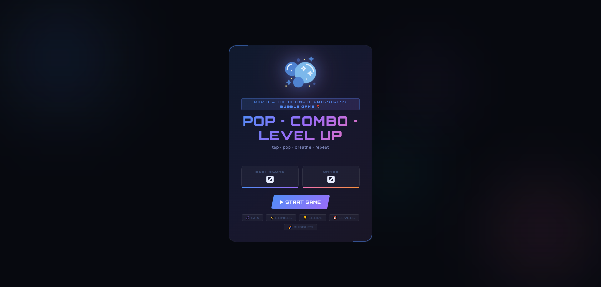
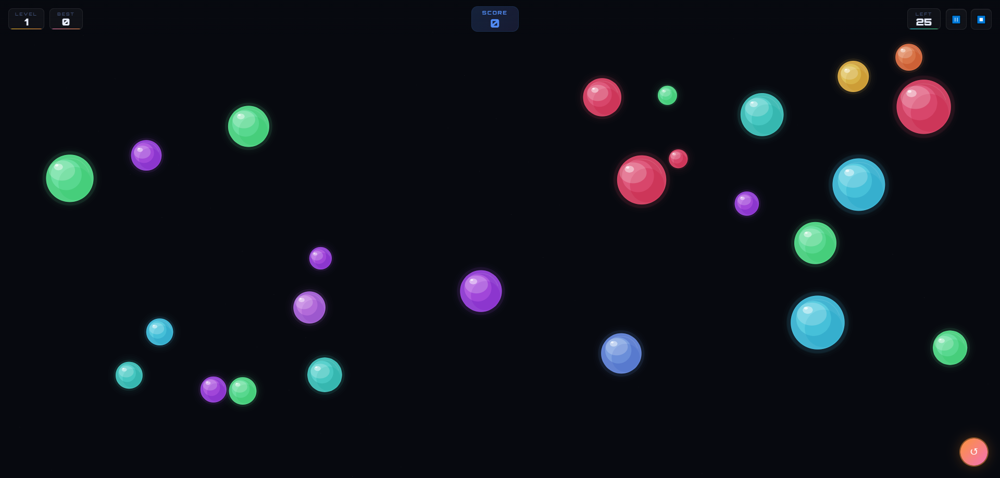

# Pop It — The Ultimate Anti-Stress Bubble Game 🎈

[](https://github.com/Darshittank/Pop-It/stargazers)
[](https://github.com/Darshittank/Pop-It/network)
[](https://github.com/Darshittank/Pop-It/issues)
[](https://opensource.org/licenses/MIT)
[](https://darshittank.github.io/Pop-It)

## 🎯 **Live Demo**
👉 **[Play Pop-It Online Now!](https://darshittank.github.io/Pop-It)** 👈

## 📖 **About Pop It**

**Pop It** is a fun and satisfying bubble popping game. Inspired by the viral fidget toy, it offers multiple game modes for relaxation, memory training, and pure enjoyment. Perfect for kids and adults alike. Pop, relax, and have fun!

### 🎯 **Key Features**

| Feature | Description |
|:--------|:------------|
| **🎯 Multi-Game Modes** | Choose from Arcade, Fidget, and Memory modes for varied gameplay. |
| **🧘 Fidget Mode** | A stress-free, no-timer, no-goals mode for pure relaxation. |
| **🧠 Memory Mode** | A challenging mode where you must pop bubbles in a specific randomized order. |
| **⚡ Arcade Mode** | Classic bubble-popping fun with progressive difficulty and a 60-second timer. |
| **🎵 Ambient Audio** | Soothing background music and satisfying "pop" sound effects. |
| **📱 Fully Responsive** | Seamless experience across desktop, tablet, and mobile devices. |
| **🎨 Dynamic Visuals** | Vibrant colors, smooth animations, and particle effects on each pop. |
| **🏆 Scoring System** | Earn points for correct pops, with bonus rewards for combos. |
| **🌓 Dark/Light Mode** | Toggle between themes for comfortable playing day or night. |
| **📊 Global Leaderboard** | Compete with players worldwide (coming soon). |

## 📸 Preview




## 🎮 **How to Play**

1. **Click** on any bubble to pop it
2. **Watch** the satisfying pop animation and sound effects
3. **Compete** with friends to see who can pop the most bubbles
4. **Reset** the board anytime to start a fresh game
5. **Challenge yourself** to pop all bubbles in the fewest moves!

**Goal:** Pop all the bubbles on the board and enjoy the stress-relieving fun!

[](https://darshittank.github.io/Pop-It)

## 📊 **Scoring System**

| Action | Points |
|--------|--------|
| Pop a single bubble | +10 pts |
| Pop 5 bubbles in a row (combo) | +15 pts each |
| Pop 10 bubbles in a row (combo) | +20 pts each |
| Clear all bubbles (Perfect Game) | +50 bonus pts |
| Reset the board | -0 pts (restart)

## 🛠️ **Technologies Used**

- **HTML5** - Semantic structure
- **CSS3** - Modern animations & responsive design
- **JavaScript (ES6+)** - Game logic & interactivity
- **LocalStorage API** - Save high scores (coming soon)

   

## 🚀 **Installation**

### Local Development

```bash
# Clone the repository
git clone https://github.com/Darshittank/Pop-It.git

# Navigate to project directory
cd Pop-It

# Open index.html in your browser
open index.html
